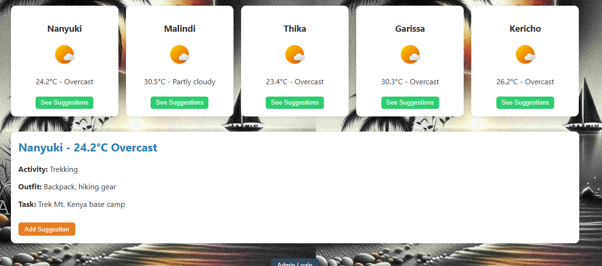
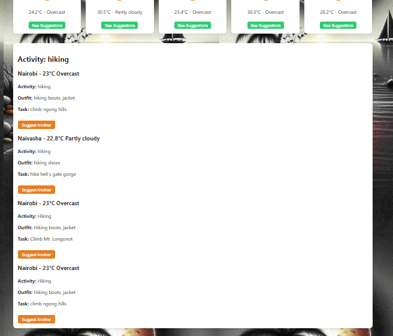

# Phase 1 Project

PapiFit Kenya – Smart Travel & Outfit Guide

Author: Peter Munyambu
Live Demo:  
License: MIT
Year: 2025

## Project Overview

PapiFit Kenya is a feature-rich Single Page Application (SPA) that provides smart travel, outfit, and activity recommendations based on real-time weather across various Kenyan cities. Users can view live weather, explore personalized outfit/activity suggestions, contribute their own ideas, and even search for an activity to find a city where the current weather fits.

Admin users are granted full CRUD functionality to manage the suggestion database in a seamless, no-redirect environment.

## Technologies

HTML
Css
Javascript
Openmeteo API
JSON server

## project structure

papifit-kenya/
├── index.html
├── style.css
├── script.js
├── server.js
├── suggestions.json
├── Assets
└── README.md

## Core Features

### Weather Dashboard

Displays live weather for 10 cities: Nairobi, Mombasa, Kisumu, Naivasha, Eldoret, Nanyuki, Malindi, Thika, Garissa, Kericho.

Shows city name, weather condition, temperature, and icon.

Weather data is fetched from the Open-Meteo API using fetch() and parsed as JSON.

### Click-to-View Suggestions

Each city card includes a "See Suggestions" button.

On click, a panel opens with:

Recommended activity
Recommended outfit
A relevant task idea
sample output:

### Activity Search by Keyword

- Users can enter any activity (e.g., "hiking") in the search bar.
  -The app filters cities with suitable weather and matching activity.
  -It then displays the most favorable city for the activity.
  on searching activity hiking
  sample output:
  

### User Add Suggestion

. Clicking a weather icon or suggestion area opens a form to add:

Activity
Outfit
Task

. Submitted via POST to the JSON server using fetch().
. Immediately reflected on the page using DOM manipulation.

### Admin Panel

.Accessed by clicking Admin Login.
.Displays all city/weather-based suggestions.

.For each item, admin can:

-Edit (opens fields; PATCH request saves changes)
-Delete (removes item from server and UI via DELETE)

.Admin clicks Logout to hide the admin panel.

## Functional Logic

🔄 Asynchronous API Calls

GET weather data from Open-Meteo API for each city

GET existing suggestions from suggestions.json

POST new user suggestions to JSON server

PATCH updated admin suggestions to server

DELETE removes selected suggestions (admin only)

## JavaScript Concepts Used

.map() → Create weather cards

.filter() → Match suggestions with weather/activity

.forEach() → Render all outfits, activities, tasks

addEventListener() → Enable click, submit, login, logout, edit

fetch() → All server and API interactions

JSON.stringify() & res.json() → Handle data formats

## Event-Driven Actions

Action

Event Type

Description

Click "See Suggestions"

click

Displays outfit, activity, task suggestions for the city

Submit Add Suggestion Form

submit

Adds user-generated suggestion via POST

Search for activity

submit

Filters city with best weather match for the activity

Admin Login/Logout Toggle

click

Shows or hides admin panel

Click Edit on a suggestion

click

Makes suggestion fields editable

Save Changes (Admin)

click

Sends PATCH request to update local data

Delete Suggestion (Admin)

click

Sends DELETE request and removes from UI

## User & Admin Roles

Role

User

✅ can view

✅ can add

❌ cant edit

❌ cant delete

Admin

✅ can view

✅ can add

✅ can edit

✅ can delete

## How to Run the App Locally

.Clone the Repository
-git clone
. Start JSON Server
npm install -g json-server
json-server --watch suggestions.json
.Launch Frontend
Open index.html in a browser.
Use Live Server for hot reloading (optional).

### Example Flow

You open the app and see all cities listed.
You search "swimming" → Mombasa shows up with warm weather.
You click "See Suggestions" → Outfit: Swimsuit, Task: Swim at Nyali Beach.
You want to suggest a new activity. You click on the weather icon.
Form appears. You submit: Activity: Yoga, Outfit: Leggings, Task: Yoga on beach.
You click Admin Login and delete a duplicate suggestion.

## License

This project is licensed under the MIT License.
© 2025 Peter Munyambu. All rights reserved.
Pull requests and contributions are welcome!
